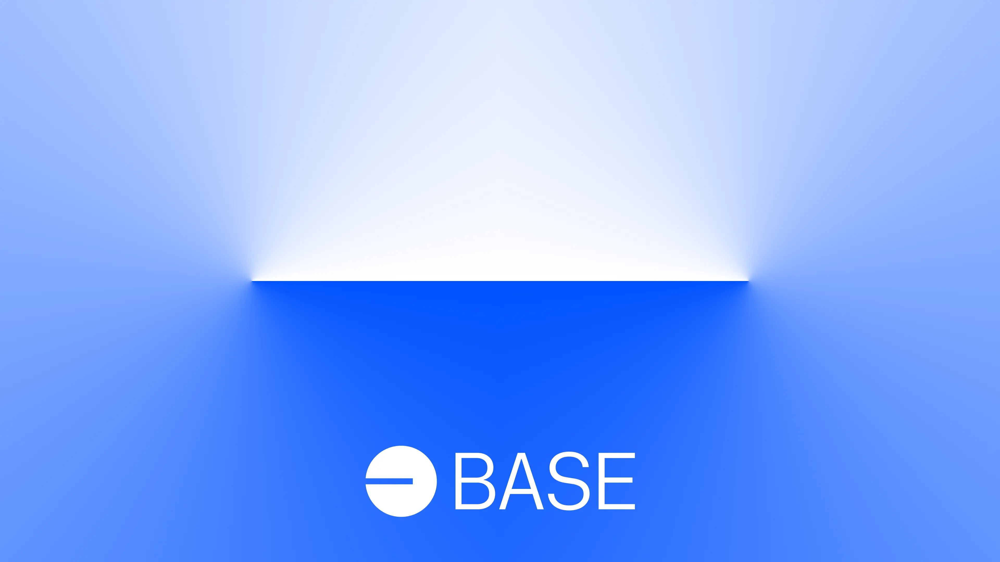

# Base brand-kit

This repo contains [brand](guides/brand-guide.pdf) and [editorial style](guides/editorial-style-guide.md) guides for Base.

Base is a secure, low-cost, developer-friendly Ethereum L2 built to bring the next billion users onchain. It's built on Optimism's open-source [OP Stack](https://stack.optimism.io/).

<!-- Badge row 1 - status -->

[](https://github.com/base-org/brand-kit/graphs/contributors)
[](https://github.com/base-org/brand-kit/graphs/contributors)
[](https://github.com/base-org/brand-kit/stargazers)


<!-- Badge row 2 - links and profiles -->

[](https://base.org)
[](https://base.mirror.xyz/)
[](https://docs.base.org/)
[](https://base.org/discord)
[](https://twitter.com/Base)

<!-- Badge row 3 - detailed status -->

[](https://github.com/base-org/brand-kit/pulls)
[](https://github.com/base-org/brand-kit/issues)

---

## Quick-Start Guide for Engineers

### Choosing the Right Format

| Use Case | Recommended Format | Why |
|----------|-------------------|-----|
| Web / Mobile UI | **SVG** | Scales to any size, crisp at all resolutions, small file size |
| Email / Static images | **PNG** | Better email client compatibility |
| Print / Large format | **EPS** | Vector format designed for print production |
| Social media posts | **PNG** | Most platforms rasterize SVGs anyway |

### Choosing the Right Logo Variant

#### Which logo to use by default

For most digital use cases, use the **Basemark** logo (`logo/Basemark/Digital/`). It is the primary brand mark and the most recognizable Base asset.

- **In-app UI, headers, favicons** → `logo/TheSquare/Digital/Base_square_blue.svg`
- **Product pages, marketing, documentation** → `logo/Basemark/Digital/Base_basemark_blue.svg`
- **Full lockup with wordmark** → `logo/Logotype/Digital/Base_lockup_2color.svg`

#### Logo variants for different backgrounds

| Background Color | Logo Variant | File |
|-----------------|-------------|------|
| Light / white backgrounds | **Blue** logo | `Base_basemark_blue.svg` |
| Dark / black backgrounds | **White** logo | `Base_basemark_white.svg` |
| Colorful / photo backgrounds | **Black** or **White** logo (whichever has better contrast) | `Base_basemark_black.svg` or `Base_basemark_white.svg` |
| Blue-themed backgrounds | **White** logo (avoid blue-on-blue) | `Base_basemark_white.svg` |

### Sizing Guidelines

| Context | Minimum Size | Recommended Size |
|---------|-------------|-----------------|
| Favicon | 16×16 px | 32×32 px |
| App icon | 32×32 px | 64×64 px |
| Navigation bar | 24 px height | 32 px height |
| Hero / splash | 48 px height | 80+ px height |
| Social media profile | 400×400 px | 800×800 px |

**Rules:**
- Never scale the logo below 16px height — it becomes illegible
- Always maintain the original aspect ratio
- Provide at least 1x the logo height in clear space around the mark

### Social Media Usage

- **Profile picture**: Use `logo/TheSquare/Digital/Base_square_blue.svg` (the square mark works best in circular crops)
- **Post images / banners**: Use `logo/Logotype/Digital/Base_lockup_2color.svg` for maximum brand recognition
- **Story / reel overlays**: Use the white Basemark on dark overlays

### File Naming Convention

All assets follow this pattern:
```
Base_[variant]_[color].[format]
```

Examples:
- `Base_basemark_blue.svg` — Basemark variant, blue color, SVG format
- `Base_lockup_white.png` — Lockup variant, white color, PNG format
- `Base_square_black.eps` — Square variant, black color, EPS format

---

### Guides

- [Brand Guide](http://base.org/brand)
- [Editorial Style Guide](guides/editorial-style-guide.md)

### Fonts

Located in [/fonts](fonts/).

### Logos


| Symbol                                            | Wordmark                                                |
| ------------------------------------------------- | ------------------------------------------------------- |
|    |    |
|    |    |
|    |    |
